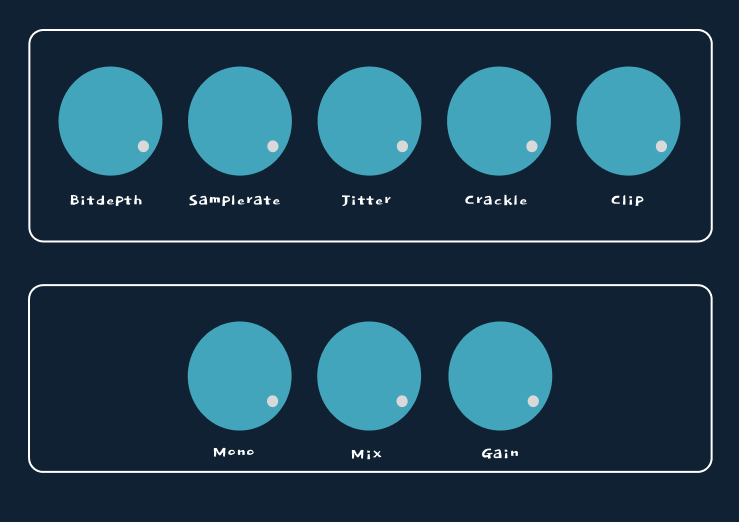

<h1>DigitalF</h2>

<h3>An audio plugin that adds digital artifacts to an audio signal</h3>


<br>

[](https://github.com/enter-opy/DigitalF)



<a href="https://www.figma.com/file/DgvtXW6EmI9wBapgfpRhhr/DigitalF-rough?node-id=10%3A2&t=BI6bLMEYsVhoLotd-1" target="_blank">
        
</a>

<hr>

<br>

<h1>Artifacts</h1>

<h2>Bitdepth</h2>

<h3><i>reduces bits per sample</i><h3>

<br>

```cpp
float wetSampleValue = round((drySampleValue)*maxBitdepthValue) / maxBitdepthValue;
```

<hr>

<h2>Sample rate</h2>

<h3><i>reduces number of samples per second</i><h3>

<br>

```cpp
int step = sampleRate / newSamplerate;

for (int i = 0; i < step && sample < buffer.getNumSamples(); i++, sample++) {
    channelData[sample] = wetSampleValue;
}
```

<hr>

<h2>Jitter</h2>

<h3><i>Modulates the pitch of signal</i><h3>

Reference: <a href="https://headfonics.com/what-is-jitter-in-audio/">📖</a>

<br>

```cpp
//to be done
```

<hr>

<h2>Crackle</h2>

<h3><i>increases the amount of occurance of cracks and pops in the signal</i><h3>

<br>

```cpp
if (crackleValue > 0) {
    if (random.nextInt(100 - crackleValue + 2) == 0) {
        if (random.nextInt(10) == 0) {
            wetSampleValue = -wetSampleValue;
        }
        else {
            wetSampleValue = 0.0;
        }
    }
}
```

<hr>

<h2>Clip</h2>

<h3><i>Limits the peak value of the signal</i><h3>

<br>

```cpp
if (wetSampleValue >= clipCeiling) {
    wetSampleValue = clipCeiling;
}
else if (wetSampleValue <= -clipCeiling) {
    wetSampleValue = -clipCeiling;
}
```

<br>

<h1>Noise</h1>

<h2>Amount</h2>

<h3><i>increases the amount of noise added</i><h3>

<br>

```cpp
float wetSampleValue += (random.nextFloat() * 2.0f - 1.0f) * noiseLevel;
```

<hr>

<h2>Compressor</h2>

<h3><i>sidechain compression for noise triggered by input signal</i><h3>

<br>

```cpp
//to be done
```

<hr>

<h2>Gate</h2>

<h3><i>sidechain gate for noise triggered by input signal</i><h3>

<br>

```cpp
//to be done
```

<hr>

<h1>Noise</h1>

<br>

<h2>LPF</h2>

<h3><i>Low pass filter cutoff</i><h3>

<br>

```cpp
//to be done
```

<hr>

<h2>HPF</h2>

<h3><i>high pass filter cutoff</i><h3>

<br>

```cpp
//to be done
```

<hr>

<h1>Mix</h1>

<br>

<h2>Dry</h2>

<h3><i>Increases the gain of dry signal</i><h3>

<br>

```cpp
//to be done
```

<hr>

<h2>Wet</h2>

<h3><i>Increases the gain of wet signal</i><h3>

<br>

```cpp
//to be done
```

<hr>